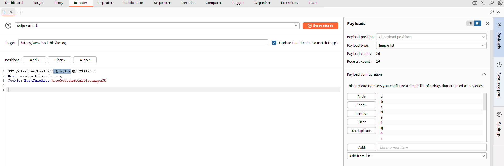
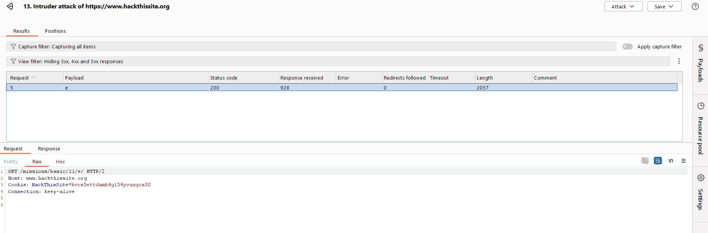

# HackThisSite.org – Basic Level 11 (Apache / Directory Enumeration)

## Challenge Information

* **CTF Name:** HackThisSite
* **Challenge Name:** Level 11
* **Category:** Web / Apache Misconfiguration
* **Difficulty:** Medium (Beginner)
* **Challenge Description:**
  Sam made a music site but does not understand Apache well. The password is hidden somewhere on the server if you can find Sam’s private collection.

---

## TL;DR (Summary)

Directory enumeration reveals hidden folders. Apache configuration files expose ignored files, leading directly to the password.

---

## Thought Process & Approach

The challenge description mentions Apache explicitly, suggesting that the solution involves server configuration or directory handling rather than client-side logic. The main page only displays random music titles, offering no direct interaction.

Inspecting the HTML reveals a comment hinting at a hidden collection, which points toward directory discovery.

---

## Initial Reconnaissance

Inspecting the page source shows:

```
<!-- We even have our own collection - if you could find it! -->
```

This confirms that the solution involves finding hidden files or directories.

---

## Directory Enumeration

I used two tools in parallel:

* **Scout** – a URL fuzzer and spider for discovering undisclosed virtual hosts, files, and directories


* **Burp Suite Intruder** – for customizable payload-based directory brute forcing





Fuzzing the target:

```
https://www.hackthissite.org/missions/basic/11/
```

Revealed the following valid paths:

```
/note
/e/
```

Visiting `/note` confirms directory listing behavior, indicating that indexing is enabled.

---

## Traversing the Directory Structure

Visiting:

```
/missions/basic/11/e/
```

Shows a directory index containing a single folder:

```
l
```

Continuing deeper:

```
/e/l/t/o/n/
```

Results in an empty directory listing, suggesting that files may be intentionally hidden.

---

## Apache Configuration Discovery

Since Apache is explicitly mentioned, I used **Burp Suite Intruder** with wordlists from **SecLists** (a curated collection of common security assessment payloads) to brute-force interesting files.

This revealed:

```
.htaccess
```

With an HTTP 200 response.

---

## Analyzing .htaccess

Visiting the file displays:

```
IndexIgnore DaAnswer.* .htaccess
<Files .htaccess>
    require all granted
</Files>
```

This configuration hides files matching `DaAnswer.*` from directory listings.

---

## Finding the Password

Accessing the ignored file directly:

```
/missions/basic/11/e/l/t/o/n/DaAnswer
```

Displays the message:

```
The answer is right here! Just look a little harder.
```

Entering **right here** as the password on:

```
/missions/basic/11/index.php
```

Successfully completes the level.

---

## Final Answer

```
right here
```
